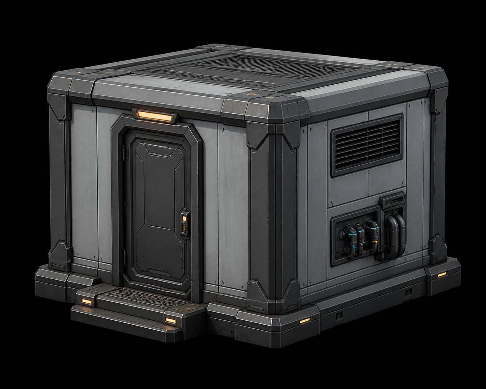

<!-- generated from prop-list.md; edit the source brief or generator for durable changes -->
---
asset_id: "asset.architecture.building-prefab-assemblies.utility-enclosure"
source_label: "utility enclosure"
source_section: "Reusable / core architecture"
source_group: "Building prefab assemblies"
source_line: 280
level: L2
status: planned
place_family: "All place families"
owner: "Axiom shared construction"
---

# utility enclosure

## Identity

- **Asset ID:** asset.architecture.building-prefab-assemblies.utility-enclosure
- **Type:** reusable prefab assembly
- **Source:** prop-list.md:280
- **Family:** Reusable / core architecture
- **Place family:** All place families
- **Owner / story role:** Axiom shared construction

## Reference render

## Intent

The **utility enclosure** is a reusable prefab assembly for the Axiom Relay kit. It exists to support
the grid-aligned chassis that lets every district feel related while retaining local dressing. Its primary read should be **utility enclosure** as a useful,
maintained, or visibly altered thing—not anonymous sci-fi decoration. At far
distance, the silhouette and mass locate it; at mid distance, the operational
face and state signal explain it; up close, the service layer rewards inspection
without changing the core language.

Keep the source label as the production name while applying the neutral Axiom Relay visual system defined in the world docs.

## Public contract

- **Blockout envelope:** 4.0 m W × 3.0 m D × 3.0 m H service enclosure; accepts exterior utility runs on two sides.
- **Grid:** 1 m world unit; snap structural breaks to 0.25 m increments.
- **Pivot:** the functional ground contact or lower-left mounting corner; keep placement stable across variants.
- **Orientation:** operational/front face points toward local +Z in the preview; document any intentional radial, overhead, or mirrored placement in implementation.
- **Sockets:** Expose foundation_*, floor_*, wall_*, ceiling_*, door_bay_*, pipe_*, duct_*, cable_*, and equipment_mount_* sockets.
- **Read distance:** far = silhouette and footprint; mid = use, ownership, and state; near = fasteners, seams, labels, wear, and material response.
- **Collision:** keep the gameplay mass simple and stable; tertiary cables, foliage, loose debris, and clutter must not become accidental snag surfaces.

## Performance and implementation

- **LOD0:** full silhouette, service layer, articulated parts, and state signal for hero/near read.
- **LOD1:** merge small repeated parts while preserving silhouette, openings, interaction face, and signal.
- **LOD2:** keep only primary mass, cover boundary, major supports, and the state-bearing accent.
- **Instancing:** repeated bolts, slats, cables, foliage clusters, crates, panels, and sibling modules should be instanced where possible.
- **Preview:** validate in neutral light, home-map light, and a 1280×720 thumbnail so value hierarchy survives the app's current capture target.

## Visual brief

Build a compact service building with a robust shell, one maintenance opening, vented overhead closure, cable/pipe penetrations, and a clear equipment mounting wall. It should support substations, generators, pumps, cooling units, and lab utilities.

The construction follows the shared **chassis → service → signal** order.
The enclosure exists to connect machinery to architecture: show intake/exhaust, cable glands, pipe flanges, equipment anchors, drainage, and a safe service route. Keep the strongest value break on the
operational face, frame any screen or opening with a physical bezel, and leave
negative space around the interaction point. Do not add unmotivated greebles;
each visible repetition needs a fastening, cooling, handling, safety, or
identity reason.

### State signal

Use AMBER-400 as the dominant signal token and CYAN-400 only
as support. Reinforce signal color with position, shape, label, pulse, or
material response. Place emission inside a lens, recess, tube, projector, or
screen housing; never float a bright line over an unexplained surface.

## Construction plan

1. Place the foundation, floor, wall runs, corners, and ceiling panel.
2. Install the door bay, vented roof panel, equipment mounts, and utility penetration sockets.
3. Validate connection to pipes, ducts, cable conduits, and industrial equipment.

## Component inventory

- **blocking: floor slab tile** — [floor slab tile](../modular-building-connectors/floor-slab-tile.md) — service floor.
- **blocking: wall 2 m** — [wall 2 m](../walls/wall-2-m.md) — enclosure wall run.
- **blocking: exterior wall corner** — [exterior wall corner](../modular-building-connectors/exterior-wall-corner.md) — outer closure.
- **blocking: door bay** — [door bay](../modular-building-connectors/door-bay.md) — maintenance opening.
- **blocking: building threshold** — [building threshold](../modular-building-connectors/building-threshold.md) — service entry transition.
- **blocking: ceiling slab panel** — [ceiling slab panel](../modular-building-connectors/ceiling-slab-panel.md) — overhead closure.
- **blocking: foundation interface** — [foundation interface](../modular-building-connectors/foundation-interface.md) — terrain/load interface.
- **optional: vented roof panel** — [vented roof panel](../roof-pieces/vented-roof-panel.md) — air exchange.
- **optional: pipe support** — [pipe support](../../industrial/pipe-support.md) — utility connection.
- **optional: electrical cabinet** — [electrical cabinet](../../industrial/electrical-cabinet.md) — service equipment.

## Materials and color

Use these canonical materials in descending surface importance:

- MAT-02 — [canonical definition](../../../../world/material-library.md).
- MAT-06 — [canonical definition](../../../../world/material-library.md).
- MAT-11 — [canonical definition](../../../../world/material-library.md).
- MAT-17 — [canonical definition](../../../../world/material-library.md).

Apply these exact semantic color tokens:

- dominant signal: AMBER-400;
- supporting signal: CYAN-400;
- neutral chassis: SHELL-200 or GRAPHITE-800 according to owner and place;
- service cavity: INK-950;
- identity, safety, or state graphics: MAT-17 over the correct substrate.

Never introduce a near-match hex value for a local fix. If a new role is truly
needed, update [the central color system](../../../../world/color-system.md) first.

## Variants and states

1. **Default** — recognition state and public contract.
2. **Weathered / Locally Repaired** — state-bearing geometry, signal, decal, and collision change.
3. **Damaged / Service Off** — reuse the chassis with a focused dressing or service pass.

Map-specific availability belongs to the assembly brief; do not delete a reusable item because one current map no longer uses it.

## Dependencies

- **Blocking:** [world concept](../../../../world/concept.md), [visual language](../../../../world/visual-language.md), [production rules](../../../../world/production-rules.md), and [dependency model](../../../../world/dependency-model.md).
- **Materials/colors:** [material library](../../../../world/material-library.md) and [color system](../../../../world/color-system.md).

- **blocking component:** [floor slab tile](../modular-building-connectors/floor-slab-tile.md) — service floor.
- **blocking component:** [wall 2 m](../walls/wall-2-m.md) — enclosure wall run.
- **blocking component:** [exterior wall corner](../modular-building-connectors/exterior-wall-corner.md) — outer closure.
- **blocking component:** [door bay](../modular-building-connectors/door-bay.md) — maintenance opening.
- **blocking component:** [building threshold](../modular-building-connectors/building-threshold.md) — service entry transition.
- **blocking component:** [ceiling slab panel](../modular-building-connectors/ceiling-slab-panel.md) — overhead closure.
- **blocking component:** [foundation interface](../modular-building-connectors/foundation-interface.md) — terrain/load interface.
- **optional component:** [vented roof panel](../roof-pieces/vented-roof-panel.md) — air exchange.
- **optional component:** [pipe support](../../industrial/pipe-support.md) — utility connection.
- **optional component:** [electrical cabinet](../../industrial/electrical-cabinet.md) — service equipment.
- No direct sibling dependency was inferred from the source label. Review the family folder before introducing a new mechanism.

## Acceptance checklist

- [ ] silhouette reads at far distance without texture detail;
- [ ] function and ownership read at mid distance;
- [ ] public envelope, pivot, sockets, and orientation are preserved;
- [ ] chassis, service, and signal layers are visibly distinct;
- [ ] only canonical MAT-* materials and color tokens are used;
- [ ] every state/variant has explicit geometry, emission, decal, and collision decisions;
- [ ] collision and LOD intent are suitable for procedural placement;
- [ ] damage or ecological contact, where relevant, has a believable cause;
- [ ] the asset works in its home place family and remains an Axiom Relay relative elsewhere.
