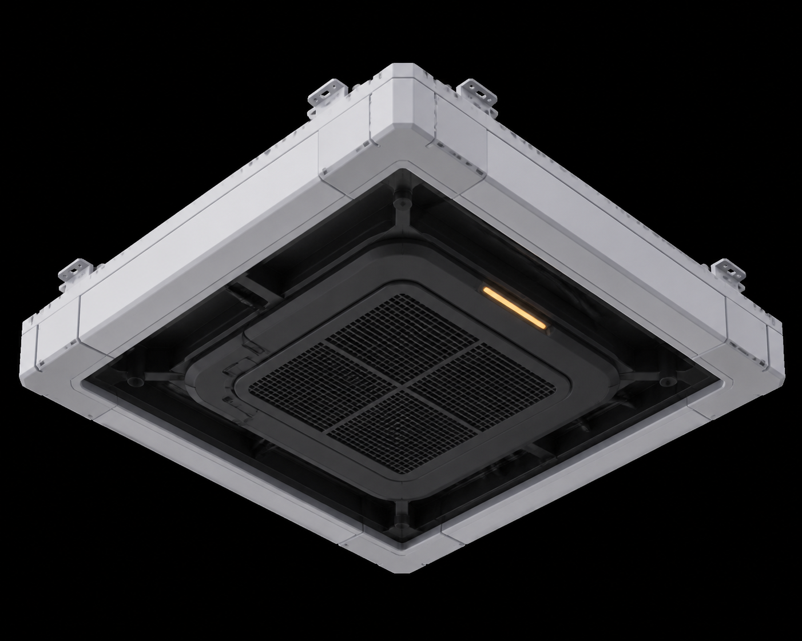

<!-- generated from prop-list.md; edit the source brief or generator for durable changes -->
---
asset_id: "asset.architecture.modular-building-connectors.ceiling-slab-panel"
source_label: "ceiling slab panel"
source_section: "Reusable / core architecture"
source_group: "Modular building connectors"
source_line: 256
level: L1
status: planned
place_family: "All place families"
owner: "Axiom shared construction"
---

# ceiling slab panel

## Identity

- **Asset ID:** asset.architecture.modular-building-connectors.ceiling-slab-panel
- **Type:** architectural connector
- **Source:** prop-list.md:256
- **Family:** Reusable / core architecture
- **Place family:** All place families
- **Owner / story role:** Axiom shared construction

## Reference render

## Intent

The **ceiling slab panel** is a architectural connector for the Axiom Relay kit. It exists to support
the grid-aligned chassis that lets every district feel related while retaining local dressing. Its primary read should be **ceiling slab panel** as a useful,
maintained, or visibly altered thing—not anonymous sci-fi decoration. At far
distance, the silhouette and mass locate it; at mid distance, the operational
face and state signal explain it; up close, the service layer rewards inspection
without changing the core language.

Keep the source label as the production name while applying the neutral Axiom Relay visual system defined in the world docs.

## Public contract

- **Blockout envelope:** 2.0 m W × 2.0 m D × 0.18 m H; overhead snap edges on the 1 m grid.
- **Grid:** 1 m world unit; snap structural breaks to 0.25 m increments.
- **Pivot:** the functional ground contact or lower-left mounting corner; keep placement stable across variants.
- **Orientation:** operational/front face points toward local +Z in the preview; document any intentional radial, overhead, or mirrored placement in implementation.
- **Sockets:** Expose ceiling_snap_n, ceiling_snap_s, ceiling_snap_e, ceiling_snap_w, roof_mount_*, service_access_*, and light_mount_* sockets.
- **Read distance:** far = silhouette and footprint; mid = use, ownership, and state; near = fasteners, seams, labels, wear, and material response.
- **Collision:** keep the gameplay mass simple and stable; tertiary cables, foliage, loose debris, and clutter must not become accidental snag surfaces.

## Performance and implementation

- **LOD0:** full silhouette, service layer, articulated parts, and state signal for hero/near read.
- **LOD1:** merge small repeated parts while preserving silhouette, openings, interaction face, and signal.
- **LOD2:** keep only primary mass, cover boundary, major supports, and the state-bearing accent.
- **Instancing:** repeated bolts, slats, cables, foliage clusters, crates, panels, and sibling modules should be instanced where possible.
- **Preview:** validate in neutral light, home-map light, and a 1280×720 thumbnail so value hierarchy survives the app's current capture target.

## Visual brief

Build a reversible overhead panel with a shallow structural frame, dark service cavity, replaceable vent or light insert, and a clean top mounting face. The underside must read clearly when seen from inside a room.

The construction follows the shared **chassis → service → signal** order.
Show panel seams, a removable service hatch, cable or ventilation paths, and a safe mounting relationship to the roof or floor above. Keep the strongest value break on the
operational face, frame any screen or opening with a physical bezel, and leave
negative space around the interaction point. Do not add unmotivated greebles;
each visible repetition needs a fastening, cooling, handling, safety, or
identity reason.

### State signal

Use AMBER-400 as the dominant signal token and CYAN-400 only
as support. Reinforce signal color with position, shape, label, pulse, or
material response. Place emission inside a lens, recess, tube, projector, or
screen housing; never float a bright line over an unexplained surface.

## Construction plan

1. Block the 2 m overhead panel and its four snap edges.
2. Add the structural frame, underside service recess, and optional vent/light insert.
3. Keep the top interface plain enough to accept a roof piece or another floor slab.
4. Validate interior readability from a standing player camera.

## Materials and color

Use these canonical materials in descending surface importance:

- MAT-02 — [canonical definition](../../../../world/material-library.md).
- MAT-06 — [canonical definition](../../../../world/material-library.md).
- MAT-11 — [canonical definition](../../../../world/material-library.md).
- MAT-17 — [canonical definition](../../../../world/material-library.md).

Apply these exact semantic color tokens:

- dominant signal: AMBER-400;
- supporting signal: CYAN-400;
- neutral chassis: SHELL-200 or GRAPHITE-800 according to owner and place;
- service cavity: INK-950;
- identity, safety, or state graphics: MAT-17 over the correct substrate.

Never introduce a near-match hex value for a local fix. If a new role is truly
needed, update [the central color system](../../../../world/color-system.md) first.

## Variants and states

1. **Default** — recognition state and public contract.
2. **Weathered / Locally Repaired** — state-bearing geometry, signal, decal, and collision change.
3. **Damaged / Service Off** — reuse the chassis with a focused dressing or service pass.

Map-specific availability belongs to the assembly brief; do not delete a reusable item because one current map no longer uses it.

## Dependencies

- **Blocking:** [world concept](../../../../world/concept.md), [visual language](../../../../world/visual-language.md), [production rules](../../../../world/production-rules.md), and [dependency model](../../../../world/dependency-model.md).
- **Materials/colors:** [material library](../../../../world/material-library.md) and [color system](../../../../world/color-system.md).

- No direct sibling dependency was inferred from the source label. Review the family folder before introducing a new mechanism.

## Acceptance checklist

- [ ] silhouette reads at far distance without texture detail;
- [ ] function and ownership read at mid distance;
- [ ] public envelope, pivot, sockets, and orientation are preserved;
- [ ] chassis, service, and signal layers are visibly distinct;
- [ ] only canonical MAT-* materials and color tokens are used;
- [ ] every state/variant has explicit geometry, emission, decal, and collision decisions;
- [ ] collision and LOD intent are suitable for procedural placement;
- [ ] damage or ecological contact, where relevant, has a believable cause;
- [ ] the asset works in its home place family and remains an Axiom Relay relative elsewhere.
