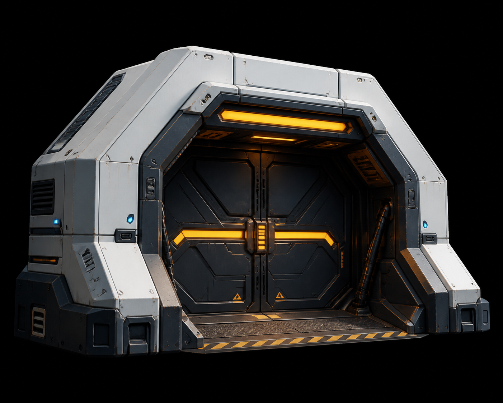

<!-- generated from prop-list.md; edit the source brief or generator for durable changes -->
---
asset_id: "asset.military.general.bunker-entrance"
source_label: "bunker entrance"
source_section: "Reusable / military and IMC reference kit"
source_group: "General"
source_line: 438
level: L2
status: planned
place_family: "Military compounds, armories, checkpoints, and frontier bases"
owner: "Axiom Defense"
---

# bunker entrance

## Identity

- **Asset ID:** asset.military.general.bunker-entrance
- **Type:** reusable bunker entrance assembly
- **Source:** prop-list.md:438
- **Family:** Reusable / military and IMC reference kit
- **Place family:** Military compounds, armories, checkpoints, and frontier bases
- **Owner / story role:** Axiom Defense

## Reference render

## Intent

The **bunker entrance** is a reusable bunker entrance assembly for the Axiom Relay kit. It exists to support
robust defense infrastructure with clear fields of fire, access control, and repair history. Its primary read should be **bunker entrance** as a useful,
maintained, or visibly altered thing—not anonymous sci-fi decoration. At far
distance, the silhouette and mass locate it; at mid distance, the operational
face and state signal explain it; up close, the service layer rewards inspection
without changing the core language.

Keep the source label as the production name while applying the neutral Axiom Relay visual system defined in the world docs.

## Public contract

- **Blockout envelope:** 6.0 m W × 4.0 m D × 4.0 m H hardened entrance frontage.
- **Grid:** 1 m world unit; snap structural breaks to 0.25 m increments.
- **Pivot:** the functional ground contact or lower-left mounting corner; keep placement stable across variants.
- **Orientation:** operational/front face points toward local +Z in the preview; document any intentional radial, overhead, or mirrored placement in implementation.
- **Sockets:** Expose road_entry_*, gate_*, booth_*, barrier_*, signage_*, light_*, fence_*, and power_* sockets.
- **Read distance:** far = silhouette and footprint; mid = use, ownership, and state; near = fasteners, seams, labels, wear, and material response.
- **Collision:** keep the gameplay mass simple and stable; tertiary cables, foliage, loose debris, and clutter must not become accidental snag surfaces.

## Performance and implementation

- **LOD0:** full silhouette, service layer, articulated parts, and state signal for hero/near read.
- **LOD1:** merge small repeated parts while preserving silhouette, openings, interaction face, and signal.
- **LOD2:** keep only primary mass, cover boundary, major supports, and the state-bearing accent.
- **Instancing:** repeated bolts, slats, cables, foliage clusters, crates, panels, and sibling modules should be instanced where possible.
- **Preview:** validate in neutral light, home-map light, and a 1280×720 thumbnail so value hierarchy survives the app's current capture target.

## Visual brief

Compose a bunker entrance from the door bay, bunker door, gate posts, wall return, threshold, and foundation interface. It must read as a structural transition into a buried facility, not as a floating door leaf.

The construction follows the shared **chassis → service → signal** order.
Make traffic flow, operator sightline, power/data, maintenance clearance, and perimeter continuity obvious. Keep the strongest value break on the
operational face, frame any screen or opening with a physical bezel, and leave
negative space around the interaction point. Do not add unmotivated greebles;
each visible repetition needs a fastening, cooling, handling, safety, or
identity reason.

### State signal

Use AMBER-400 as the dominant signal token and COBALT-500 only
as support. Reinforce signal color with position, shape, label, pulse, or
material response. Place emission inside a lens, recess, tube, projector, or
screen housing; never float a bright line over an unexplained surface.

## Construction plan

1. Place the road module, threshold, gate post pair, lintel, and wall returns.
2. Attach the checkpoint booth, control panel, barriers, fence, and directional/signage sockets.
3. Validate active, open, locked, damaged, and abandoned states.

## Component inventory

- **blocking: door bay** — [door bay](../architecture/modular-building-connectors/door-bay.md) — hardened opening.
- **blocking: bunker door** — [bunker door](../architecture/doors/bunker-door.md) — moving blast closure.
- **blocking: gate post pair** — [gate post pair](../architecture/gate-closure/gate-post-pair.md) — entry jamb structure.
- **blocking: gate wall return** — [gate wall return](../architecture/gate-closure/gate-wall-return.md) — perimeter/hill continuity.
- **blocking: building threshold** — [building threshold](../architecture/modular-building-connectors/building-threshold.md) — protected entry transition.
- **blocking: foundation interface** — [foundation interface](../architecture/modular-building-connectors/foundation-interface.md) — ground anchoring.
- **blocking: door control panel** — [door control panel](../architecture/doors/door-control-panel.md) — entry control.
- **optional: tactical floodlight** — [tactical floodlight](./tactical-floodlight.md) — night access signal.

## Materials and color

Use these canonical materials in descending surface importance:

- MAT-02 — [canonical definition](../../../world/material-library.md).
- MAT-04 — [canonical definition](../../../world/material-library.md).
- MAT-05 — [canonical definition](../../../world/material-library.md).
- MAT-17 — [canonical definition](../../../world/material-library.md).

Apply these exact semantic color tokens:

- dominant signal: AMBER-400;
- supporting signal: COBALT-500;
- neutral chassis: SHELL-200 or GRAPHITE-800 according to owner and place;
- service cavity: INK-950;
- identity, safety, or state graphics: MAT-17 over the correct substrate.

Never introduce a near-match hex value for a local fix. If a new role is truly
needed, update [the central color system](../../../world/color-system.md) first.

## Variants and states

1. **Default** — recognition state and public contract.
2. **Weathered / Locally Repaired** — state-bearing geometry, signal, decal, and collision change.
3. **Damaged / Service Off** — reuse the chassis with a focused dressing or service pass.

Map-specific availability belongs to the assembly brief; do not delete a reusable item because one current map no longer uses it.

## Dependencies

- **Blocking:** [world concept](../../../world/concept.md), [visual language](../../../world/visual-language.md), [production rules](../../../world/production-rules.md), and [dependency model](../../../world/dependency-model.md).
- **Materials/colors:** [material library](../../../world/material-library.md) and [color system](../../../world/color-system.md).

- **blocking component:** [door bay](../architecture/modular-building-connectors/door-bay.md) — hardened opening.
- **blocking component:** [bunker door](../architecture/doors/bunker-door.md) — moving blast closure.
- **blocking component:** [gate post pair](../architecture/gate-closure/gate-post-pair.md) — entry jamb structure.
- **blocking component:** [gate wall return](../architecture/gate-closure/gate-wall-return.md) — perimeter/hill continuity.
- **blocking component:** [building threshold](../architecture/modular-building-connectors/building-threshold.md) — protected entry transition.
- **blocking component:** [foundation interface](../architecture/modular-building-connectors/foundation-interface.md) — ground anchoring.
- **blocking component:** [door control panel](../architecture/doors/door-control-panel.md) — entry control.
- **optional component:** [tactical floodlight](./tactical-floodlight.md) — night access signal.
- No direct sibling dependency was inferred from the source label. Review the family folder before introducing a new mechanism.

## Acceptance checklist

- [ ] silhouette reads at far distance without texture detail;
- [ ] function and ownership read at mid distance;
- [ ] public envelope, pivot, sockets, and orientation are preserved;
- [ ] chassis, service, and signal layers are visibly distinct;
- [ ] only canonical MAT-* materials and color tokens are used;
- [ ] every state/variant has explicit geometry, emission, decal, and collision decisions;
- [ ] collision and LOD intent are suitable for procedural placement;
- [ ] damage or ecological contact, where relevant, has a believable cause;
- [ ] the asset works in its home place family and remains an Axiom Relay relative elsewhere.
